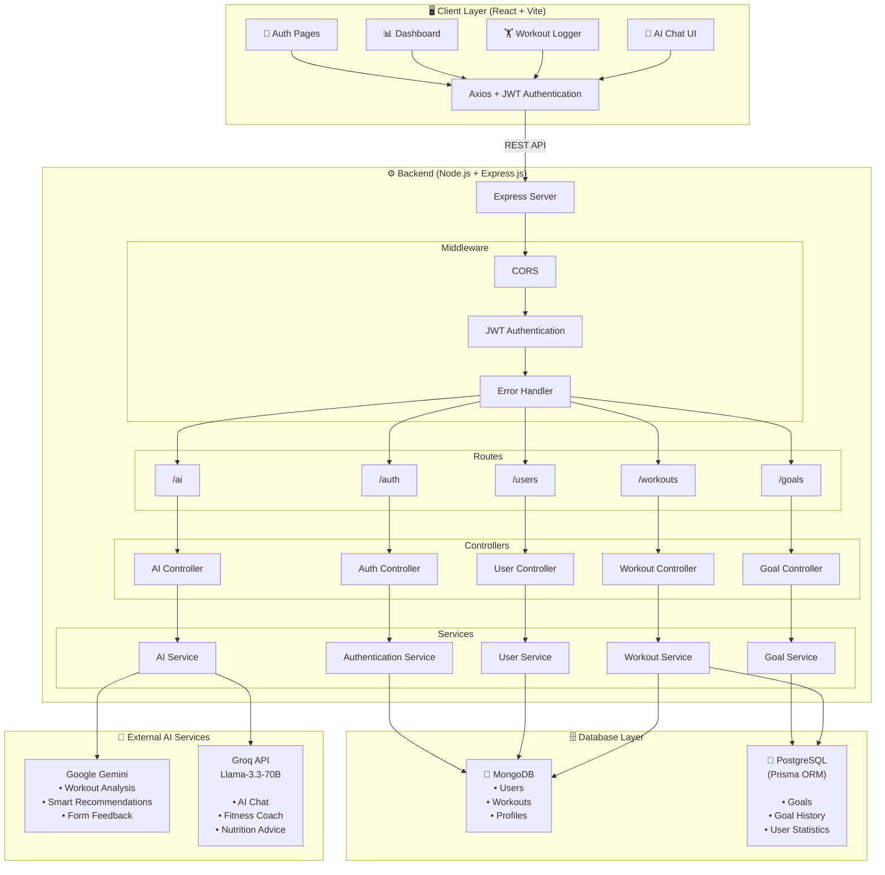

# 💪 PulseTrack AI - The AI-Powered Fitness Companion

**PulseTrack AI** is a comprehensive, full-stack fitness tracking application designed to empower users by providing them with intelligent tools to log workouts, track progress, set personalized goals, and receive real-time, context-aware fitness advice from an AI coach. Built with a robust backend using Node.js, Express, and a dual-database architecture (MongoDB + PostgreSQL), and a dynamic frontend with React and Tailwind CSS, this project showcases a modern, scalable, and user-centric design.

---

## 🌟 Key Features

### 🤖 AI-Powered Fitness Coach
- **Instant Workout Feedback (Powered by Google Gemini):** Get immediate, detailed AI-generated feedback on individual workout logs to improve form, intensity, and technique.
- **Context-Aware AI Chat (Powered by Groq API):** A smart, real-time assistant (Llama-3.3-70b) that analyzes the user's recent workout history, current XP level, and active goals to provide highly personalized training and nutrition advice.
- **Persistent Chat History:** Conversations are saved locally, allowing users to seamlessly resume their coaching sessions across page reloads.
- **Hinglish Support:** Understands and responds naturally in a mix of Hindi and English for a more relatable experience.

### 📊 Dashboard & Analytics
- **Interactive Charts:** Visualizes workout distribution (Pie Chart) and weekly activity trends (Bar Chart) using Recharts.
- **Body Metrics & BMI Tracking:** Log height and weight to calculate BMI, with a historical progress graph (MM/YYYY format).
- **Smart Data Loading:** Recent workouts display only the last 2 days for fast initial load, while charts and stats leverage all-time data for comprehensive insights.
- **Skeleton Loaders:** Modern UI loading states for a polished user experience.

### 🏋️ Workout Management
- **Comprehensive Logger:** Log detailed workout sessions including exercise type, duration, calories burned, and personal notes.
- **AI Feedback:** Get instant, AI-generated feedback on individual workout logs to improve form and intensity.
- **Dedicated History Page:** View up to the last 10 days of workout history via a separate, easily accessible page from the Navbar.

### 🎮 Gamification & Progression
- **XP & Leveling System:** Earn XP based on workout intensity and duration to level up through ranks: Beginner 🌱 → Rising Star ⭐ → Beast 🦍 → Legend 👑.
- **Dynamic Goal Tracking:** Set weekly minute goals with a real-time progress bar. Goals automatically reset upon completion, saving the history for motivation.
- **Level-Up Notifications:** Celebrate achievements with a toast notification that only triggers on actual level-ups (not page reloads).

### 🎨 User Experience
- **Dark/Light Mode:** Fully responsive theme toggle with smooth transitions.
- **Custom Avatars:** Choose from 6 unique gradient avatars with emojis to personalize the profile.
- **Mobile-First Design:** Fully responsive UI for seamless use on any device.
- **Intuitive Navigation:** Cancel buttons and Escape key support on forms for smooth UX.

---

## 🛠️ Tech Stack & Architecture

This project follows a clean, modular architecture with a clear separation of concerns between the service layer and controller layer.

### Backend (Node.js & Express)
- **Express.js:** Fast, unopinionated web framework for building RESTful APIs
- **MongoDB & Mongoose:** NoSQL database for workouts and user profiles (flexible schema)
- **PostgreSQL & Prisma ORM:** Relational database for goals, goal history, and structured user stats
**Multer**: Middleware for handling `multipart/form-data`, used for secure profile photo uploads
- **JWT (JSON Web Tokens):** Secure authentication and authorization
- **Groq SDK:** Integration with Groq API for ultra-fast AI inference
- **dotenv:** Environment variable management
- **cors & helmet:** Security and cross-origin handling

### Frontend (React)
- **React (Vite):** Fast and modern UI library with optimized build tooling
- **Tailwind CSS:** Utility-first styling for rapid, responsive design
- **React Router:** Client-side routing for seamless navigation
- **Axios:** HTTP client for communicating with the backend
- **Recharts:** Interactive data visualization (Pie & Bar charts)
- **React Hot Toast:** Elegant toast notifications for user feedback
- **Context API:** Global state management for Auth and Theme

### AI Integration (Dual-Model Architecture)
- **Google Gemini:** Integrated for generating instant, detailed, and analytical feedback on individual workout logs.
- **Groq API (Llama-3.3-70b-versatile):** Integrated for the real-time AI Chat Widget. Groq's ultra-fast inference engine delivers context-aware conversational responses with personalized user data injection (recent workouts, XP level, current goal).

### Architecture Diagram

## 🏗️ System Architecture


# 🚀 Getting Started Locally

To run the project on your local machine, ensure you have the following installed:

- Git
- Node.js (v18 or later)
- MongoDB (Local or MongoDB Atlas)
- PostgreSQL (Local or Neon)
- npm or yarn

---

## 1️⃣ Clone the Repository

```bash
git clone https://github.com/pushpak9kumar/pulsetrack-ai.git
cd pulsetrack-ai
```

---

## 2️⃣ Backend Setup (Node.js + Express)

Navigate to the backend folder:

```bash
cd backend
npm install
```

### Create Environment Variables

Create a `.env` file inside the `backend` folder.

```env
PORT=5000

MONGODB_URI=your_mongodb_connection_string

DATABASE_URL=your_postgresql_connection_string

JWT_SECRET=your_jwt_secret

GROQ_API_KEY=your_groq_api_key

GEMINI_API_KEY=your_gemini_api_key
```

### Start the Backend

```bash
npx prisma generate
npx prisma migrate deploy
npm run dev
```

The backend server will start at:

```
http://localhost:5000
```

---

## 3️⃣ Frontend Setup (React + Vite)

Open a new terminal.

```bash
cd frontend
npm install
```

### Create Environment Variables

Create a `.env` file inside the `frontend` folder.

```env
VITE_API_URL=http://localhost:5000/api
```

### Start the Frontend

```bash
npm run dev
```

The frontend application will start at:

```
http://localhost:5173
```

---

# 🌐 Application URLs

| Service | URL |
|---------|-----|
| Frontend | http://localhost:5173 |
| Backend API | http://localhost:5000/api |

---

# 📡 API Endpoints

| Method | Endpoint | Description | Authentication |
|:------:|----------|-------------|:--------------:|
| POST | `/api/auth/register` | Register a new user | ❌ |
| POST | `/api/auth/login` | Login and receive JWT | ❌ |
| GET | `/api/workouts` | Get workout history | ✅ |
| POST | `/api/workouts` | Log a workout | ✅ |
| DELETE | `/api/workouts/:id` | Delete a workout | ✅ |
| GET | `/api/users/stats` | Get XP & Level statistics | ✅ |
| GET | `/api/users/goal` | Get current goal | ✅ |
| PUT | `/api/users/goal` | Update goal | ✅ |
| GET | `/api/users/goal/history` | Goal history | ✅ |
| POST | `/api/ai/chat-coach` | AI Fitness Coach Chat | ✅ |

---

# 📄 License

This project is licensed under the **MIT License**.

---

# 👨‍💻 Author

**Pushpak**

Passionate about building intelligent, scalable, and user-centric full-stack applications.

- GitHub: https://github.com/pushpak9kumar
- LinkedIn: https://www.linkedin.com/in/pushpak94681/